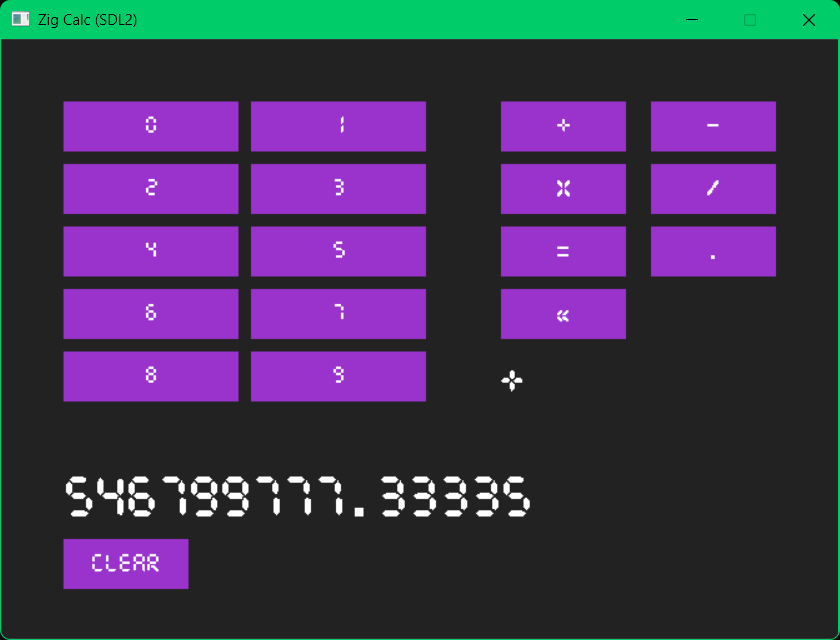

# Zig Calc Project

Version: 0.0.1

## Overview
This project is developed using the Zig programming language and SDL2 library. It is my pet project to learn about Zig and SDL2. 

I am using [ikskuh's SDL.zig](https://github.com/ikskuh/SDL.zig) library.

Currently only tested on Windows 11.

## Features
- **VERY** basic calculator features
- Dark mode 😁
- I don't know, just test it

## Build Instructions
First download **Mingw** versions of both [SDL2](https://github.com/libsdl-org/SDL/releases/tag/release-2.32.8) and [SDL2_ttf](https://github.com/libsdl-org/SDL_ttf/releases/tag/release-2.24.0).

Copy /bin, /include and /lib folders inside <project_folder>/SDL2 folder.

Run the following command to build the project:

`zig build run`

## Dependencies
- Zig (v0.14.0)
- SDL2
- SDL2_ttf

## License
This project is licensed under the MIT License.

## Contributing
Feel free to fork, contribute, and improve the project!

